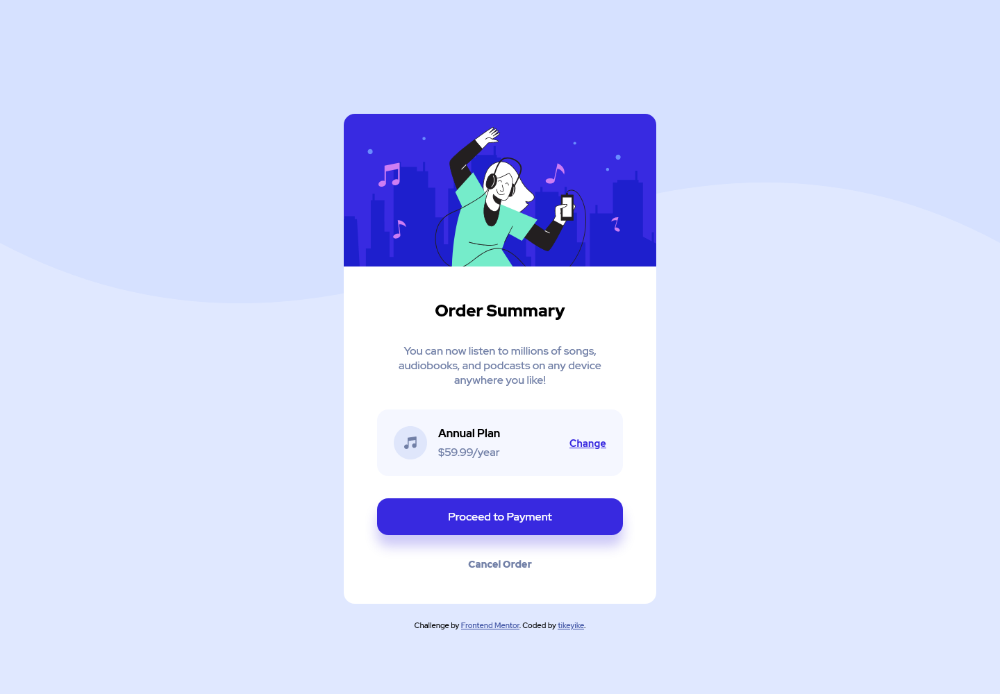

# Frontend Mentor - Order summary card solution

This is a solution to the [Order summary card challenge on Frontend Mentor](https://www.frontendmentor.io/challenges/order-summary-component-QlPmajDUj). Frontend Mentor challenges help you improve your coding skills by building realistic projects.

## Table of contents

- [Frontend Mentor - Order summary card solution](#frontend-mentor---order-summary-card-solution)
  - [Table of contents](#table-of-contents)
  - [Overview](#overview)
    - [The challenge](#the-challenge)
    - [Screenshot](#screenshot)
    - [Links](#links)
  - [My process](#my-process)
    - [Built with](#built-with)
    - [Continued development](#continued-development)
  - [Author](#author)

## Overview

### The challenge

Users should be able to:

- See hover states for interactive elements

### Screenshot

### Links

- Solution URL: [github.com/tikeyike/order-summary-component-main](https://github.com/tikeyike/order-summary-component-main)
- Live Site URL: [tikeyike.github.io/order-summary-component-main/index](https://tikeyike.github.io/order-summary-component-main/index)

## My process

### Built with

- Semantic HTML5 markup
- CSS custom properties
- Flexbox
- CSS Grid

### Continued development

I need to improve on writing better HTML markup as well as writing reusable/generic CSS classes, so I can reuse styles that already exist

## Author

- Frontend Mentor - [@tikeyike](https://www.frontendmentor.io/profile/tikeyike)
